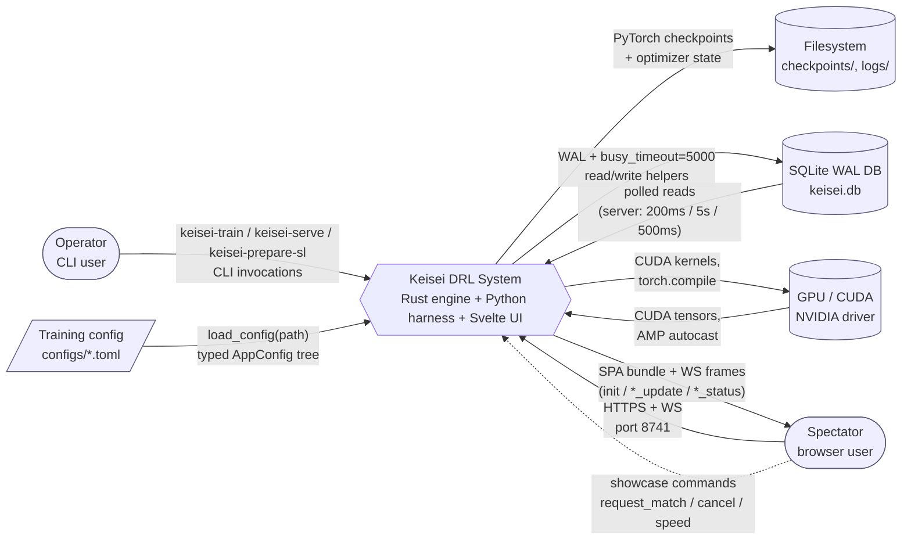
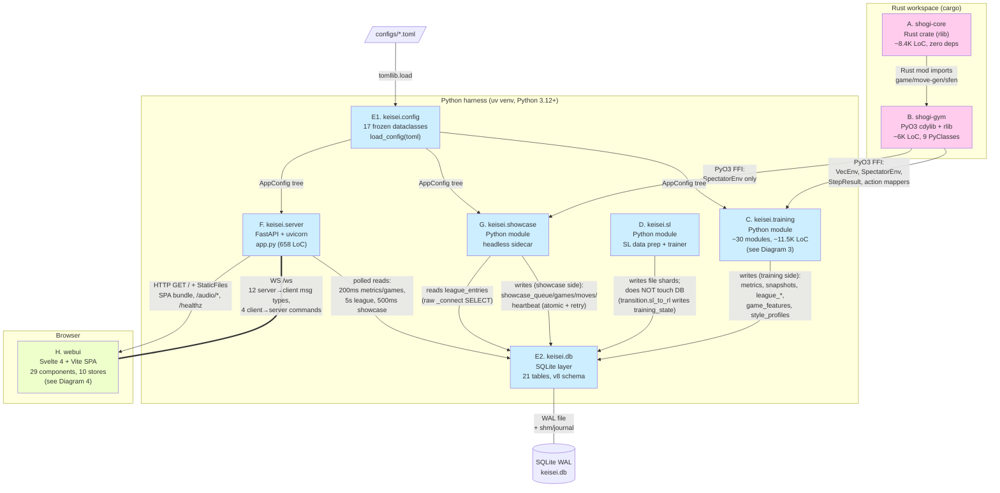
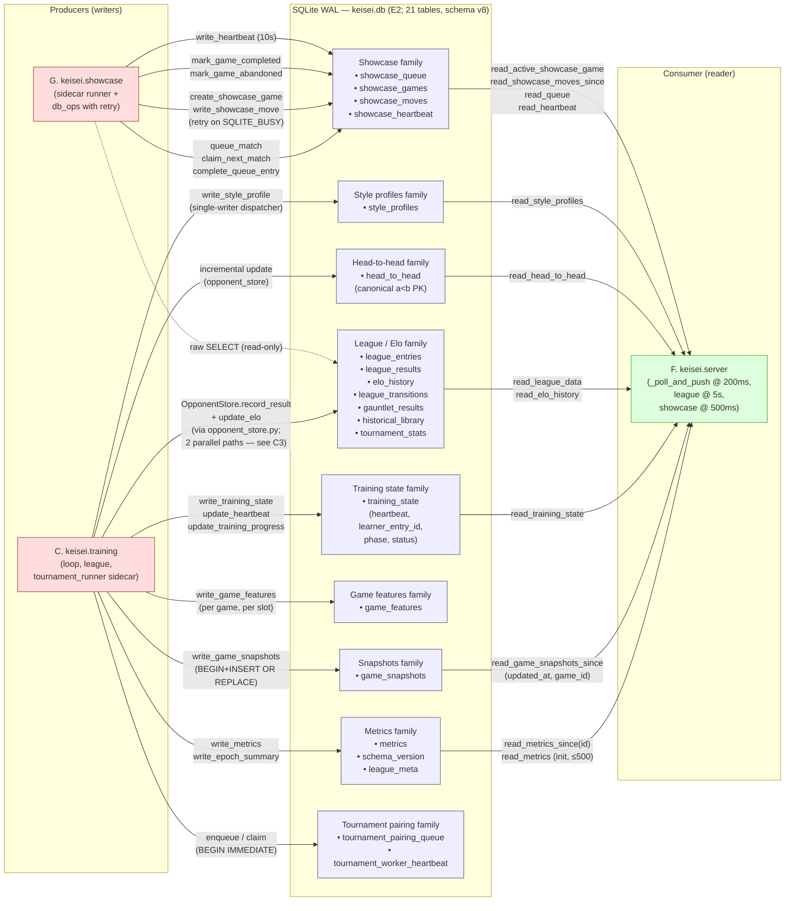

# Architecture Diagrams — Keisei

These diagrams complement `02-subsystem-catalog.md`. Subsystem labels (A, B, C1a, C1b, C2, C3, C4, C5, D, E1, E2, F, G, H1–H7) match the catalog so a reader can drill into any node by jumping to the corresponding entry.

Conventions:
- `graph TD/LR` is used for context/container/component views.
- `sequenceDiagram` is used for runtime traces.
- Every edge is labelled. No bare arrows.
- Diagrams stay above their abstraction floor: no shogi-core internals appear in L1/L2; no per-file webui detail appears in L2.

---

## 1. C4 Level 1 — System Context

What this shows: Keisei treated as a single black-box system, surrounded by the human actors and external substrates it interacts with. Data flows are direction-labelled. Internal subsystems are deliberately hidden — they appear in Diagram 2.

Deliberately omitted at L1: the FFI boundary, SQLite as message bus, Rust-vs-Python split, internal training subsystems. Showcase, training, server, and webui are all collapsed into the single "Keisei" box.



---

## 2. C4 Level 2 — Container View

What this shows: the eight subsystem containers from discovery, with language/runtime annotations and the four well-defined integration boundaries (PyO3 FFI, SQLite WAL, FastAPI HTTP+WS, TOML loader). Direction of dataflow is on every edge.

Deliberately omitted at L2: the inner module structure of `keisei.training` (see Diagram 3), webui sub-views (see Diagram 4), individual table families inside SQLite (see Diagram 7), and showcase/runner internals.



Notes:
- `D → C` exists too (`transition.sl_to_rl` invokes `SLTrainer` and then bridges into `KataGoTrainingLoop(resume_mode="sl")`); not drawn separately to keep edges legible. See catalog C1b → D.
- `G → C` exists at the Python-import level: `showcase/inference.py` imports `model_registry.{build_model, get_model_contract, get_obs_channels}` from `keisei.training.models`. This is a one-way *type* import, not a runtime/data dependency; not drawn at L2.

---

## 3. C4 Level 3 — `keisei.training` Components

What this shows: the densest bucket. C1a (PPO core), C1b (loop+orchestration), C2 (models+registry), C3 (league/tournament — by far the heaviest), C4 (style/features), C5 (evaluate CLI), with `D` (SL) shown as an external collaborator. `katago_loop.py` is rendered as the integration hub. Within C3, `OpponentStore` is drawn as the universal anchor and the two parallel match-recording paths are shown explicitly.

Deliberately omitted: every dataclass and helper not on a coupling edge; SL's internal modules (catalog entry D); the contents of C2's individual models; deep internals of `concurrent_matches.py` slot machinery.

```mermaid
graph TD
    subgraph C1a [" C1a — PPO core "]
        KP[katago_ppo.py<br/>KataGoPPOAlgorithm<br/>RolloutBuffer<br/>loss helpers]
        GAE[gae.py<br/>compute_gae / _gpu]
        VA[value_adapter.py<br/>Scalar / MultiHead]
    end

    subgraph C1b [" C1b — Loop & orchestration "]
        LOOP[["katago_loop.py<br/>1989 LoC INTEGRATION HUB<br/>main() = keisei-train"]]
        DT[dynamic_trainer.py<br/>DynamicTrainer]
        CK[checkpoint.py]
        DIST[distributed.py]
        TRANS[transition.py<br/>sl_to_rl]
        AR[algorithm_registry.py]
    end

    subgraph C2 [" C2 — Models & registry "]
        MR[model_registry.py<br/>_REGISTRY +<br/>validate_model_params]
        MODELS[models/*.py<br/>se_resnet (multi_head)<br/>resnet/mlp/transformer/<br/>katago_base/base]
    end

    subgraph C3 [" C3 — League / tournament (densest hotspot) "]
        OS[["OpponentStore<br/>(opponent_store.py)<br/>ANCHOR — imported<br/>by 8+ modules"]]
        TP[TieredPool<br/>tiered_pool.py]
        TM[FrontierMgr / RecentFixed /<br/>DynamicMgr<br/>(tier_managers.py)]
        FP[FrontierPromoter]
        HL[HistoricalLibrary]
        HG[HistoricalGauntlet]
        RE[RoleEloTracker]
        MS[MatchScheduler]
        MU[match_utils.py<br/>play_match / play_batch]
        PS[PriorityScorer]
        CM[ConcurrentMatchPool<br/>concurrent_matches.py]
        T1[["LeagueTournament<br/>(tournament.py)<br/>_record_match_result"]]
        TQ[tournament_queue.py<br/>pairing queue + heartbeat]
        TD[TournamentDispatcher<br/>tournament_dispatcher.py]
        T2[["tournament_runner.py<br/>(sidecar worker)<br/>_record_result"]]
        DEMO[DemonstratorRunner]
    end

    subgraph C4 [" C4 — Style / features "]
        GFT[game_feature_tracker.py]
        SP[style_profiler.py]
    end

    subgraph C5 [" C5 — evaluate CLI "]
        EVAL[evaluate.py<br/>keisei-evaluate]
    end

    D_ext[["D. keisei.sl<br/>(SLTrainer + dataset)"]]
    B_ext[["B. shogi_gym<br/>VecEnv (lazy import in 7 files)"]]
    DBext[["E2. keisei.db"]]

    %% C1a wiring
    KP -->|"uses"| GAE
    KP -->|"uses adapter"| VA

    %% C1b -> C1a/C2/C3/D
    LOOP -->|"instantiates<br/>KataGoPPOAlgorithm"| KP
    LOOP -->|"build_model"| MR
    LOOP -->|"writes/reads<br/>training_state, metrics,<br/>snapshots, epoch_summary"| DBext
    LOOP -->|"VecEnv.step / reset<br/>(observation_mode=katago,<br/>action_mode=spatial)"| B_ext
    LOOP -->|"build entire<br/>league stack"| TP
    LOOP -->|"DDP setup"| DIST
    LOOP -->|"save/load"| CK
    DT -->|"reuses ppo_clip_loss /<br/>wdl_cross_entropy_loss"| KP
    DT -->|"store.save_weights"| OS
    TRANS -->|"invokes"| D_ext
    TRANS -->|"resume_mode='sl'"| LOOP
    AR -->|"registers KataGoPPOParams"| KP

    %% C2 wiring
    MR -->|"factory"| MODELS

    %% C3 internal coupling — show density
    TP -->|"composes"| TM
    TP -->|"composes"| HL
    TP -->|"composes"| RE
    TP -->|"composes"| MS
    TP -->|"composes"| HG
    TP -->|"composes"| DT
    TM -->|"reads/writes pool"| OS
    HL -->|"slot rows"| OS
    FP -->|"reads candidates"| OS
    PS -->|"score history"| OS
    MS -->|"classify_match"| PS
    HG -->|"play_match"| MU
    MU -->|"loads opponents"| OS
    CM -->|"slots × shared VecEnv"| B_ext
    CM -->|"per-slot tracker"| GFT

    %% Two parallel match-recording paths (CRITICAL)
    T1 ===>|"path 1: in-process<br/>store.record_result +<br/>2× store.update_elo +<br/>RoleEloTracker.update_from_result<br/>(NOT one txn — see C3 concerns)"| OS
    T1 -->|"_run_concurrent_round"| CM
    T1 -->|"VecEnv (lazy)"| B_ext
    T1 -.->|"lazy import"| DBext
    TD -->|"enqueue pairings"| TQ
    TQ -->|"BEGIN IMMEDIATE<br/>claim_next_pairings_batch"| DBext
    T2 ===>|"path 2: sidecar<br/>_record_result via own SQL<br/>(divergence risk)"| OS
    T2 -->|"polls"| TQ
    T2 -->|"VecEnv (lazy)"| B_ext
    TD -->|"single-writer<br/>recompute_style_profiles"| SP
    DEMO -->|"VecEnv (lazy)"| B_ext

    %% C2 -> OS
    OS -->|"build_model<br/>(rebuild from arch+params)"| MR

    %% C4
    GFT -->|"per-game features"| DBext
    SP -->|"read_all_game_features +<br/>write_style_profile"| DBext

    %% C5
    EVAL -->|"build_model"| MR
    EVAL -->|"_get_policy_flat<br/>(private import)"| DEMO
    EVAL -->|"VecEnv (lazy)"| B_ext

    classDef hub fill:#fdd,stroke:#a33,stroke-width:2px
    classDef anchor fill:#fda,stroke:#a63,stroke-width:2px
    classDef parallel fill:#eef,stroke:#33a
    class LOOP hub
    class OS anchor
    class T1,T2 parallel
```

Key callouts:
- `katago_loop.py` (red) is the single Python module that imports across C1a/C1b/C2/C3 and the FFI — splitting it is flagged in the catalog (C1b concerns).
- `OpponentStore` (orange) is the universal anchor across C3 — 8+ inbound C3 edges plus inbound from C1b.
- The two thick edges into `OpponentStore` highlight the parallel match-recording paths (`tournament._record_match_result` vs `tournament_runner._record_result`) that are drift-prone (see C3 concerns; open `keisei-fa604bad63`, `keisei-ea85c3d5b5`).

---

## 4. C4 Level 3 — WebUI Components

What this shows: H1 as the WebSocket-owning shell, the `lib/ws.js` dispatcher routing 8 inbound message types into 14 stores, and the four tab views H2–H6 plus H7 cross-cutting infrastructure. Outbound commands are shown as the only client→server channel.

Deliberately omitted: every individual `.svelte` file (29 of them); inline derived stores; the testing layer; the per-localStorage-key map (9 keys, see catalog H4/H7).

```mermaid
graph TD
    subgraph H1 [" H1 — App shell + WS "]
        APP[App.svelte<br/>root + Training tab inline]
        WS[lib/ws.js<br/>connect + reconnect<br/>sendShowcaseCommand]
        SI[StatusIndicator.svelte]
        TB[TabBar.svelte]
    end

    subgraph stores [" Stores (selected) "]
        Sgames[(games)]
        Smetrics[(metrics<br/>cap=10000)]
        Strain[(trainingState)]
        Sleague[(league.js<br/>17 derived stores)]
        Sshow[(showcase.js)]
        Snav[(navigation /<br/>theme / audio /<br/>notation / aboutLevel)]
    end

    subgraph H2 [" H2 — Live game viewer (Training) "]
        BD[Board / PieceTray /<br/>MoveLog / EvalBar /<br/>WinProbGraph / CommentaryPanel]
    end

    subgraph H3 [" H3 — League view "]
        LV[LeagueView<br/>LeagueTable / LeagueEventLog /<br/>MatchupMatrix / RecentMatches /<br/>EntryDetail / HistoricalLibrary]
    end

    subgraph H4 [" H4 — Showcase view "]
        SV[ShowcaseView<br/>MatchControls / MatchQueue /<br/>MatchScorecard / ShowcaseStatsBanner]
    end

    subgraph H5 [" H5 — Metrics & charts "]
        MG[MetricsGrid<br/>MetricsChart<br/>(uplot)]
    end

    subgraph H6 [" H6 — About "]
        AB[AboutView<br/>5-level slider]
    end

    subgraph H7 [" H7 — Cross-cutting infra "]
        H7m[safeParse / timeFormat /<br/>indicator / configTooltip /<br/>roleIcons / collapseEvents /<br/>9× persisted-pref idiom]
    end

    Server[["F. keisei.server<br/>FastAPI /ws + StaticFiles"]]

    Server ==>|"WS frame: init"| WS
    Server -->|"game_update"| WS
    Server -->|"metrics_update"| WS
    Server -->|"training_status"| WS
    Server -->|"league_update"| WS
    Server -->|"showcase_update"| WS
    Server -->|"showcase_status"| WS
    Server -->|"showcase_error"| WS
    Server -.->|"ping (15s)"| WS

    WS -->|"games (delta-merge)"| Sgames
    WS -->|"append + cap"| Smetrics
    WS -->|"merge"| Strain
    WS -->|"diffLeagueEntries +<br/>derived rebuild"| Sleague
    WS -->|"showcase delta"| Sshow

    APP -->|"connect()"| WS
    APP -->|"renders by $activeTab"| TB

    Sgames --> BD
    Smetrics --> BD
    Strain --> SI
    Smetrics --> MG
    Sleague --> LV
    Sshow --> SV
    Strain --> LV
    Sleague --> SV
    Snav --> APP
    Snav --> H7m

    APP -->|"Training tab inline"| BD
    APP -->|"Training tab inline"| MG
    APP -->|"$activeTab=='league'"| LV
    APP -->|"$activeTab=='showcase'"| SV
    APP -->|"$activeTab=='about'"| AB

    SV -.->|"sendShowcaseCommand:<br/>request_showcase_match /<br/>change_showcase_speed /<br/>cancel_showcase_match"| WS
    WS -.->|"client→server JSON"| Server

    H7m -.->|"used by all views"| BD
    H7m -.->|"used by all views"| LV
    H7m -.->|"used by all views"| SV

    classDef store fill:#ffd,stroke:#aa3
    class Sgames,Smetrics,Strain,Sleague,Sshow,Snav store
```

(See `02-subsystem-catalog.md` "Data flow: WebSocket message → store(s) updated → consuming view(s)" table for the full per-message store/view mapping.)

---

## 5. Sequence — Training rollout, end-to-end (one PPO step)

What this shows: a single training step from `keisei-train`'s loop driving `shogi_gym.VecEnv`, through Rust core move generation, back into Python for PPO update, checkpoint persistence, opponent store admission, and the eventual server→webui WS push.

Kept simple: ~13 actors and ~16 messages. Deliberately omits: DDP all-reduce internals; CUDA stream details; the lazy-import dance; per-env partitioning inside `split_merge_step`; bootstrap-on-truncation logic. See C1a/C1b in the catalog for those.

```mermaid
sequenceDiagram
    autonumber
    participant Loop as katago_loop.py<br/>(C1b)
    participant VE as shogi_gym.VecEnv<br/>(B, PyO3)
    participant Core as shogi-core::game<br/>(A, Rust)
    participant Algo as KataGoPPOAlgorithm<br/>(C1a)
    participant CK as checkpoint.py<br/>(C1b)
    participant OS as OpponentStore<br/>(C3)
    participant DB as keisei.db<br/>(E2)
    participant Srv as FastAPI server<br/>(F)
    participant UI as webui<br/>(H)

    Loop->>VE: step(actions, env_ids)
    VE->>Core: apply_move + legal_moves<br/>(per env, Rayon parallel)
    Core-->>VE: new positions, rewards, dones
    VE-->>Loop: StepResult{obs, reward, done, metadata}
    Loop->>Loop: split_merge_step:<br/>route per-env to learner / opponent
    Loop->>Algo: rollout_buffer.add(...)<br/>compute_gae (when buffer full)
    Algo->>Algo: ppo_clip_loss + wdl_cross_entropy_loss<br/>+ AMP + grad clip
    Algo-->>Loop: updated weights
    Loop->>CK: save_checkpoint(state_dict, optimizer, RNG)
    CK-->>Loop: checkpoint path
    Loop->>OS: snapshot_learner / record_result<br/>(admit to RecentFixed; write league_entries)
    OS->>DB: INSERT/UPDATE league_entries,<br/>league_results, head_to_head, elo_history
    Loop->>DB: write_epoch_summary<br/>(metrics + training_state + WAL checkpoint)

    Note over Srv,DB: Async, decoupled
    Srv->>DB: poll read_metrics_since(last_id)<br/>+ read_training_state (200ms)
    DB-->>Srv: new rows
    Srv->>UI: WS metrics_update / training_status / league_update
    UI->>UI: stores update → reactive views render
```

---

## 6. Sequence — Showcase match, end-to-end

What this shows: a spectator-initiated showcase match flowing through the queue, picked up by the showcase sidecar, played out via `SpectatorEnv` (FFI), with each move written to the DB and streamed back over WS.

Kept simple: ~7 actors and ~12 messages, focused on the queue→runner→DB→WS dataflow. Deliberately omits: heartbeat thread interleaving (see G concerns); model cache LRU; retry-on-SQLITE_BUSY backoff; signal handling; auto-showcase fallback path.

```mermaid
sequenceDiagram
    autonumber
    participant UI as webui<br/>(MatchControls — H4)
    participant WS as ws.js<br/>(H1)
    participant Srv as FastAPI server<br/>(F)
    participant DB as keisei.db<br/>(E2)
    participant Run as ShowcaseRunner<br/>(G — sidecar process)
    participant Env as shogi_gym.SpectatorEnv<br/>(B, PyO3)
    participant Inf as showcase.inference<br/>(ModelCache + run_inference)

    UI->>WS: sendShowcaseCommand("request_showcase_match",<br/>{entry_id_1, entry_id_2, speed})
    WS->>Srv: WS JSON {type:"request_showcase_match", ...}
    Srv->>Srv: validate speed, ids, queue depth ≤ 5
    Srv->>DB: showcase_db_ops.queue_match(...)
    Srv-->>WS: WS "showcase_match_queued" + "showcase_status"
    WS-->>UI: stores: showcaseQueue updated

    Note over Run,DB: Sidecar polls every 5s
    Run->>DB: claim_next_match (atomic UPDATE...RETURNING)
    DB-->>Run: queue row (status='running')
    Run->>DB: create_showcase_game → game_id
    Run->>Env: SpectatorEnv(max_ply=512, action_mode=spatial)

    loop until game over / max_ply / shutdown
        Run->>Env: get_observation()
        Env-->>Run: obs (46 channels for KataGo; padded→50)
        Run->>Inf: run_inference(model, obs) → (policy_logits, win_prob)
        Inf-->>Run: logits, value
        Run->>Run: mask illegal, softmax(temp=0.5), sample
        Run->>Env: legal_moves_with_usi() (pre-step capture)
        Run->>Env: step(action)
        Env-->>Run: new state + termination
        Run->>DB: write_showcase_move (atomic INSERT + UPDATE total_ply,<br/>BEGIN IMMEDIATE + retry on SQLITE_BUSY)
        Run->>Run: pace via _speed_event.wait(delay)
    end

    Run->>DB: mark_game_completed(result) + complete_queue_entry

    Note over Srv,DB: Async, decoupled
    Srv->>DB: poll read_showcase_moves_since(game_id, last_ply) (500ms)
    DB-->>Srv: new moves
    Srv->>WS: WS "showcase_update" {game, new_moves}
    WS-->>UI: showcaseGame / showcaseMoves stores updated
```

---

## 7. Data-flow — DB-as-message-bus

What this shows: the SQLite database as the explicit integration substrate between writers (training, showcase) and the single reader (server). Tables are grouped by entity family. Webui never appears in this diagram by design — it consumes the DB exclusively via the WS layer.

Deliberately omitted: per-table column lists (see catalog E2 §"Tables created in init_db"); migration chain (see catalog E2 §"Migration chain"); the exact read functions per table (catalog E2 §"Read/write API families").



Notes on the bus model:
- `keisei.training` is the only writer to the league/Elo/feature/style/state/snapshot/metrics families.
- `keisei.showcase` is the only writer to the showcase family (modulo server-mediated control commands which still go through `db_ops` with the same retry path).
- `keisei.server` is read-only against every family — the rule is enforced by convention, not by SQL permissions.
- `tournament_pairing_queue` is unusual: written by `tournament_dispatcher.py` (in-process trainer) and *also* atomically claimed/updated by `tournament_runner.py` sidecars. Both are training-bucket processes (C3), so the writer-set is still "training only" at the bucket level.
- Webui is intentionally absent — see catalog cross-cutting observation §8.2 ("DB is the message bus").

---

## Deferred / lower-confidence rendering

- **C3 internal coupling** is shown as a flat graph; a more accurate L3.5 view would distinguish the "in-process tournament thread" subgraph (`LeagueTournament` + `ConcurrentMatchPool` + direct `OpponentStore` writes) from the "sidecar worker" subgraph (`TournamentDispatcher` → `tournament_pairing_queue` → `tournament_runner`). Deferred to keep Diagram 3 ≤ ~30 nodes.
- **shogi-core internal modules** (board, position, move-gen, zobrist, sfen, perft) are not drawn — Diagram 2 stops at the crate boundary as required by the abstraction floor. A separate Rust-internals diagram could be authored from `02-subsystem-catalog.md` §A if needed.
- **WebSocket message schema details** (field-level payload shape) are not drawn; the catalog's WS subsection in F is the source of truth.
- **DDP / multi-GPU dataflow** is omitted from Diagram 5; current confidence is low (catalog C1b notes "multi-node setup needs investigation"). Single-GPU case is rendered.
- **CUDA stream / `flush_timings` instrumentation** in `KataGoPPOAlgorithm` is not rendered; open issue (filigree, P2 in-progress) implies the timing path is incomplete.

---

## Cross-references back to the catalog

| Diagram | Primary catalog entries to read |
|---|---|
| 1. System Context | E1, E2, F, H (overview only) |
| 2. Container View | A, B, C (overview), D, E1, E2, F, G, H |
| 3. Training components | C1a, C1b, C2, C3, C4, C5, plus D for the SL→RL bridge |
| 4. WebUI components | H1–H7, plus the WS message → store → view table at the top of the H bucket |
| 5. Training rollout sequence | C1a, C1b, C2, C3, B, E2, F, H1 |
| 6. Showcase sequence | G, F, B (SpectatorEnv), E2, H4 |
| 7. DB-as-bus | E2 (table inventory), C3 (writers), G (writers), F (readers) |
